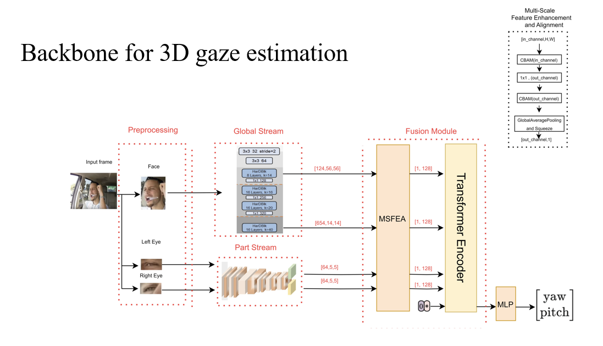
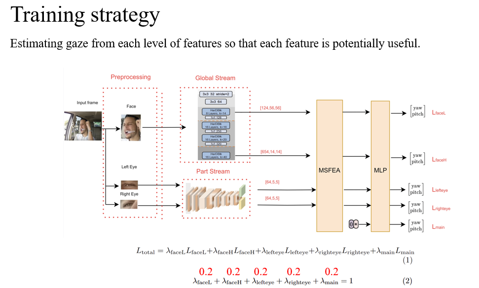
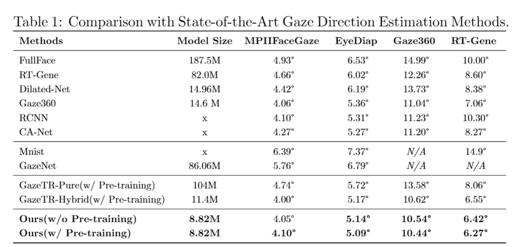
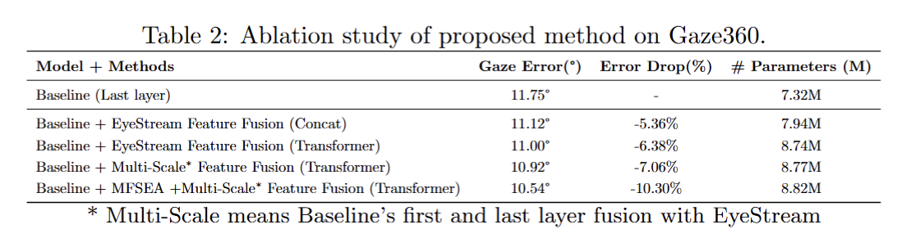

# Remote Eye tracking for DMS/landmark detection
The proposed architecture for remote eye tracking.

   

Training strategy

   

Result on popular gaze estimation dataset

   

Alation study

   

---
